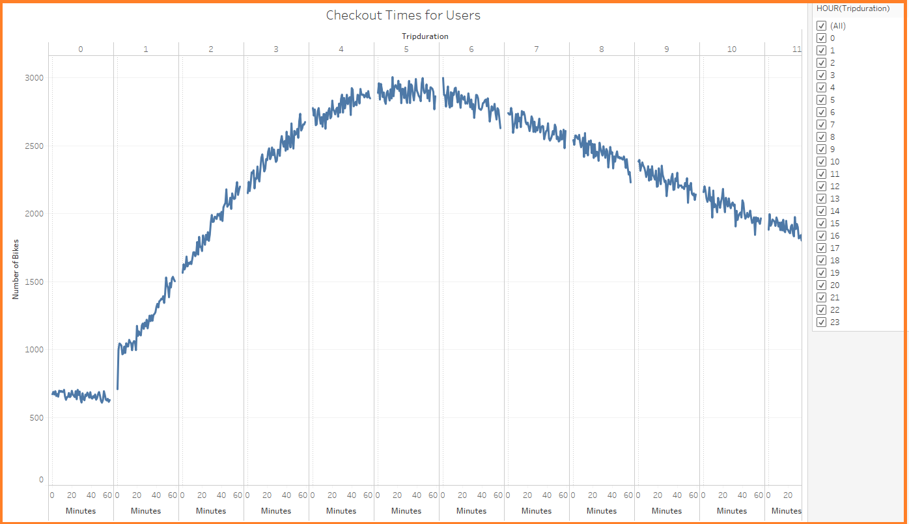
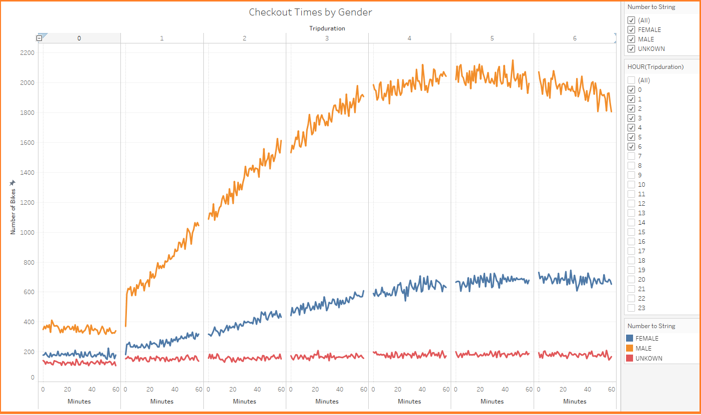
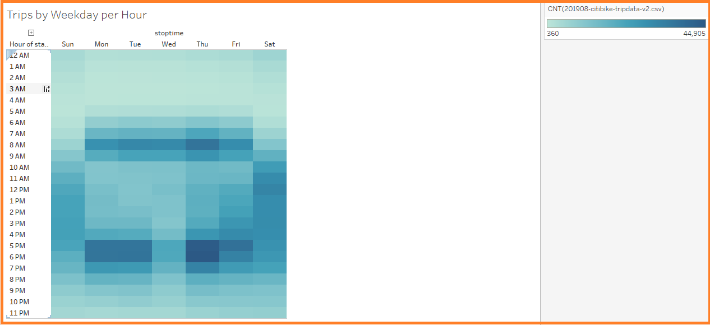
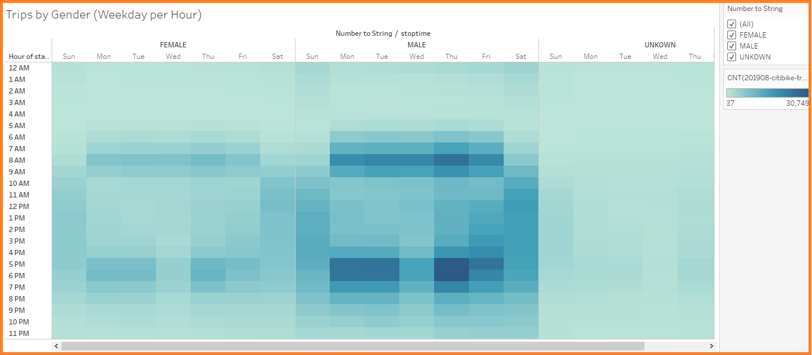
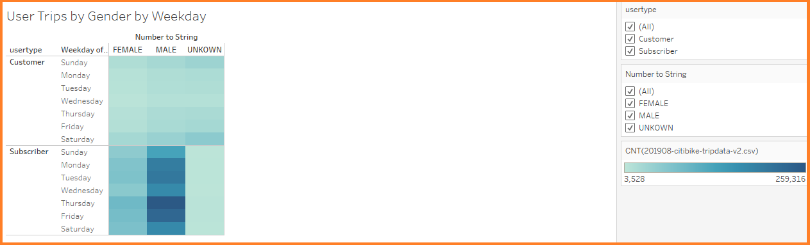

# bikesharing
New project on Mission to Mars analysis. Adjusting the current web app.

## Project Overview
Using knowledge of Tableau to visualize the bike-sharing program in Des Moines as a solid business proposal to investors. To solidify the proposal, one of the key stakeholders would like to see a bike trip analysis.

For this analysis, you’ll use Pandas to change the "tripduration" column from an integer to a datetime datatype. Then, using the converted datatype, you’ll create a set of visualizations to:

- Show the length of time that bikes are checked out for all riders and genders
- Show the number of bike trips for all riders and genders for each hour of each day of the week
- Show the number of bike trips for each type of user and gender for each day of the week.

These new visualizations alongside the two previoulsy created will be used for the final presentation and analysis to pitch to investors.

## Purpose
The purpose of this project is to visualize the bike sharing program in Des Moines as a solid business proposal  for investors.

## Resources
- **Webpage:** [link to dashboard](https://public.tableau.com/profile/allisha.samuels#!/vizhome/NYCCitibikeAnalysis_16012480265000/NYCCitibikeAnalysis/ "link to dashboard")
- **Data Source:** `NYC citibank starter code`, `index.html`, `samples.json`, `image.jpg`
- **Software:** `VS Code`, `Jupyer Notebook`, `Anaconda`, `GitHub`, `Tableau Public`

## NYC Citibike Analysis Results
>
### Checkout Times by User
>
> Trip duration thats occur between 4 and 5 hours accounts for more than 20% of total number of rides
>
>**Image showing the Checkout Times by User Storyboard:**
>
>
>
### Checkout Times by Gender
>
> Male have the highest usage across the genders, with hours 4, 5 and 6 having the highest duration
>
>**Image showing the Checkout Times by Gender Storyboard:**
>
>
>
### Trips by Weekday per Hour
>
> During the week (Mondays to Friday), ride hours are significantly more, during the early mornings between 6 am and 10 am and evening between 5pm and 8pm. Though on Wednesday, there is few/hours campared to the rest of the week. it As the days approaches towards the weekend there is a shift in ride hours as the demand increases; whereas on Saturdays it is observed that ride hours are higher between 10 am and 7 pm. On Sundays, there are fewer demand compared to Saturday. Sunday hours occurs between 11am and 5pm.
>
>**Image showing the Trips by Weekday per Hour Storyboard:**
>
>
>
### Trips by Gender (Weekday per Hour)
>
> The data is heavily concentrated with the male gender, hence Males are more frequent riders. Similarly to our findings in the previous chart, the busiest periods are Mondays to Friday 6 am to 10 am, and 5pm and to 8pm. On Weekends, particulary Saturday, the busy periods are between 10 am to 7pm. This is likely due to the fact that most people areoff from work.
>
>**Image showing the Trips by Gender (Weekday per Hour) Storyboard:**
>
>
>
### User Trips By Gender by Weekday
>
> Of all the genders, the Male subcribers appears to have the highest usage with Thursday, Friday and throughout the weekend proving the busiest of them all.
>
>**Image showing the User Trips By Gender by Weekday Storyboard:**
>
>
>
>
## Summary
>Majority of the riders are Males (65%), campared to all other genders. Wednesays have less hours compared to the rest of the week, whilst Thursdays has proven to be busiest day especialy with the male genders. During the week, the busiest times are those that occur between the times before (6 am to 10) and after work (5pm and 8pm).On Weekends, particullary Saturdays, the days are remains highest with the male subscibers and are more frequent between 10am and 5pm
>
>### Two additional visualizations that could be performed with the given dataset are:
1. Visualization can be pased on the location to find out which location has the highest usage station iDs
2. Another visualization could be distance travelled using the bike ID along with station ID (start and end)
3. Similar to the gender type analysis, another could be conducted using the age, to odentify which age group uses the services more, and this could also be compared against gender as well to tell an even more imformative story
